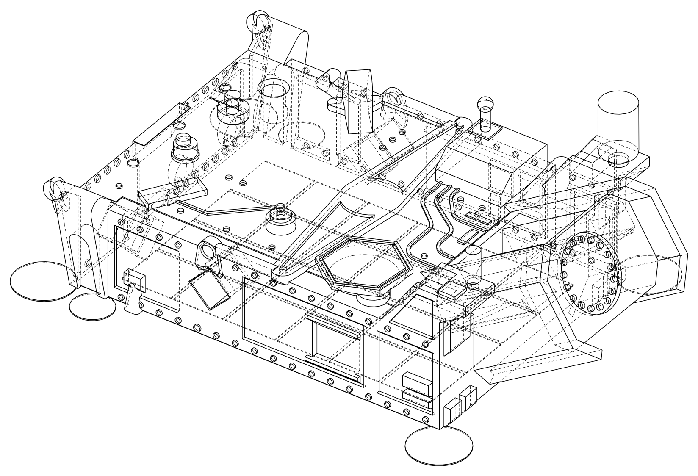
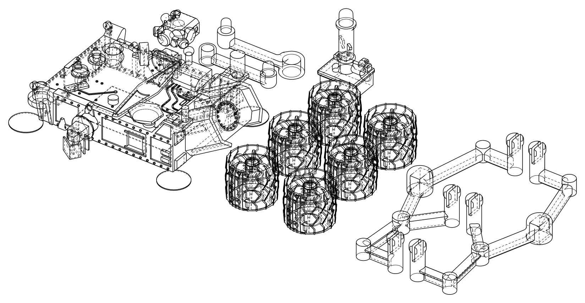

# DraftingKit

**Hidden-line-removed 2D vector drawings from 3D triangle meshes, in pure Swift.**

Give it a mesh (STL, OBJ, USDZ) and an orthographic view; it returns classified
visible/hidden polylines with exact bounds, in model units — ready to place on
a plan sheet as scale-accurate PDF, SVG, or `CGPath`.



*NASA's Curiosity rover chassis (18,328-triangle STL) rendered by one
`makeLineDrawing` call — solid visible edges, dashed hidden lines.
Model: [NASA 3D Resources](https://github.com/nasa/NASA-3D-Resources)
(NASA/JPL-Caltech, no copyright).*

## What it does

- **Parses STL** (binary + ASCII, autodetected) with a stdlib-only parser;
  OBJ / USDZ / anything `MDLAsset` reads via the `DraftingModelIO` target on
  Apple platforms. Vertex welding, adjacency, and diagnostics for filthy
  wild-caught meshes (degenerate triangles, boundary edges, non-manifold edges).
- **Classifies candidate edges** per view: boundary, crease (dihedral
  threshold), and silhouette edges — with a foreshortening-aware filter so
  finely tessellated models keep their outlines.
- **Removes hidden lines** by visibility sampling with bisection refinement
  (the classic Appel insight, implemented by sampling — no exact-arithmetic
  epsilon hell), accelerated by a BVH over projected triangles.
- **Chains and cleans**: collinear sub-segments merge into polylines; hidden
  lines that coincide with visible ones are suppressed (the cube's back edges
  don't dash over its front edges).
- **Deterministic, always**: identical input produces byte-identical output —
  serial or parallel, macOS or Linux. Output is canonically ordered; a test
  pins it.
- **Zero dependencies.** The core imports nothing beyond the Swift standard
  library — no Foundation, no simd, no Dispatch — and runs on Linux.

## Quick start

```swift
import DraftingCore

var diagnostics = MeshDiagnostics()
let mesh = try STL.parse(stlBytes, diagnostics: &diagnostics)

let drawing = await makeLineDrawing(mesh: mesh, view: .isometric)

let svg = drawing.svg()                     // styled SVG string
```

On Apple platforms, add scale-accurate PDF output:

```swift
import DraftingGraphics

// A millimeter-unit model placed at 1:4 → (72 / 25.4) / 4 pt per unit.
var style = PDFStyle(pointsPerModelUnit: (72 / 25.4) / 4)
style.margin = 18
let pdf = drawing.pdfData(style: style)     // NSImage(data: pdf) draws vector-sharp
```

The PDF media box is exactly `bounds.size × pointsPerModelUnit + 2 × margin`,
so drawings place on documents at true dimensional scale. (Keep the box under
the PDF page limit of 14,400 pt — choose `pointsPerModelUnit` accordingly.)

## Views

`OrthographicView` takes any `forward`/`up` pair; named views cover the
drafting standards for Z-up models: `.front`, `.back`, `.left`, `.right`,
`.top`, `.bottom`, `.isometric`. The screen basis is documented and pinned by
tests: `right = normalize(forward × up)`, `trueUp = right × forward`, depth
increases into the scene.

## Options

| Option | Default | Effect |
| --- | --- | --- |
| `creaseAngleDegrees` | 30 | Dihedral angle above which a shared edge is drawn. Raise to 45–60° for noisy scans. |
| `includeHiddenLines` | true | Emit occluded geometry as `.hidden` paths. |
| `suppressHiddenCoincidentWithVisible` | true | Drop hidden lines that duplicate visible ones. |
| `sampleSpacingFraction` | 1/512 | Visibility sample spacing, as a fraction of the projected diagonal. |
| `epsilonFraction` | 1e-6 | Occlusion depth tolerance, as a fraction of the model diagonal. Raise to 1e-5…1e-4 for bumpy scan surfaces. |

## Large meshes

DraftingKit is comfortable at scan scale — a 1.3M-triangle engine scan
classifies ~530k paths in under 2 seconds (Apple Silicon, release build):



*The full Curiosity print plate: 384,538 triangles → 79,112 classified paths.*

Practical guidance:

- Call the **async** `makeLineDrawing` overload — it fans the per-edge work
  out over a task group and keeps every heavy phase off the calling actor.
  The synchronous form is the serial reference; both produce identical bytes.
- Build the `Mesh` once per file (welding dominates import) and reuse it
  across views.
- For display, rasterize large drawings asynchronously rather than handing a
  half-million-path PDF to an image view; keep the vector PDF for export and
  print. The bundled demo shows the pattern.
- `swift test` runs debug builds — benchmark with `-c release` (10–30×).

## Demo app

A SwiftUI test harness ships in the package (macOS):

```sh
swift run -c release DraftingDemo                   # GUI: import, orbit, tune, export
swift run -c release DraftingDemo bench <file>      # headless timings
swift run -c release DraftingDemo hero <file> <dir> # render PNG + SVG assets
```

## Determinism & purity

- `Sources/DraftingCore` imports nothing beyond the Swift standard library —
  enforced by the Ubuntu CI leg, which builds and tests the whole pipeline on
  Linux.
- Parallel stages write into index-addressed arrays and output is canonically
  sorted, so serial and parallel runs are byte-identical (tested, including at
  100k-triangle scale).
- Trig for the crease threshold is computed with an internal degree-domain
  polynomial — bit-identical across platforms, unlike libm.

## Non-goals (v1) / roadmap

Deliberately out of scope for v1: perspective projection, section views and
cutting planes, arc/circle recovery on output polylines, Metal depth-buffer
occlusion, STEP/B-rep input, mesh repair beyond welding, corner-joining path
chaining, textures/materials, any UI beyond the demo.

Planned next: cooperative cancellation for long runs, parallel welding,
scan-tuned presets, section views, and arc fitting (the pipeline's stage
boundaries were designed for these).

## Acknowledgments

- The sampling-based visibility design follows the spirit of Arthur Appel's
  1967 hidden-line work; this implementation is clean-room, from spec.
- Hero imagery derives from the
  [NASA 3D Resources](https://github.com/nasa/NASA-3D-Resources) Curiosity
  rover models (NASA/JPL-Caltech). NASA does not endorse this project.

## License

MIT © 2026 Justice Engineering. See [LICENSE](LICENSE).
